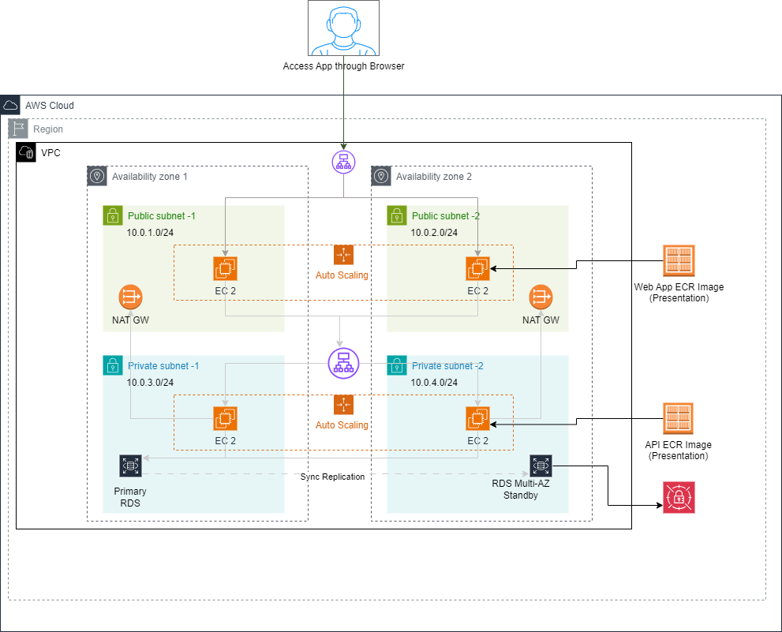

# Three Tier Infra on AWS - Example


## Architecture Diagram




## Azure DevOps Pipeline
The Azure DevOps pipeline is used to deploy the infrastructure and the application. The pipeline is defined in [cicd](cicd/) folder.
There are two pipelines:
 - [build.yml](cicd/build.yml) = This pipeline is used to build the application and create the docker images in AWS ECR.
 - [deploy-infra.yml](cicd/deploy-infra.yml) = This pipeline is used to deploy  the infrastructure and the application. 

### 1. **build.yml** Pipeline runs when there is any change in the following folders and builds the application and creates the docker images in AWS ECR.:
      - application-tier/**
      - presentation-tier/**
Any changes in the above folders will trigger this pipeline as there are changes in the application code.


### 2. **deploy-infra.yml** Pipeline runs when build.yml pipeline is completed. It deploys the infrastructure and the application.


## Running manually

### Prerequisites
1. Install the following tools:
  - [Terraform](https://www.terraform.io/downloads.html)
  - [AWS CLI](https://docs.aws.amazon.com/cli/latest/us/cli/latest/userguide/getting-started-install.html)  
  - [Docker](https://docs.docker.com/get-docker/)
  - [JQ](https://stedolan.github.io/jq/download/)

1. Create docker images for both web and app tiers and push them to AWS ECR
```bash
chmod +x ./deploy-ecr-images.sh
./deploy-ecr-images.sh
```

2. Deploy the Terraform infrastructure
```bash
cd terraform/
terraform init # Initialize the Terraform backend
terraform plan # Plan the infrastructure
terraform apply # Apply the infrastructure
```

3. Access the application on web browser using ALB DNS name
```
To view the application, open the following URL in your browser:
   http://<ALB-DNS>/ 

To initialize the database, open the following URL in your browser:
   http://<ALB-DNS>/init

To view the users, open the following URL in your browser:
  http://<ALB-DNS>/users
```

4. Deploy the Terraform infrastructure
```bash
cd terraform/
terraform destroy # Destroy the infrastructure
```

5. Delete the ECR images
```bash
chmod +x ./destroy-ecr-images.sh
./destroy-ecr-images.sh
```


## References
https://ecsworkshop.com/secrets/02-overview/