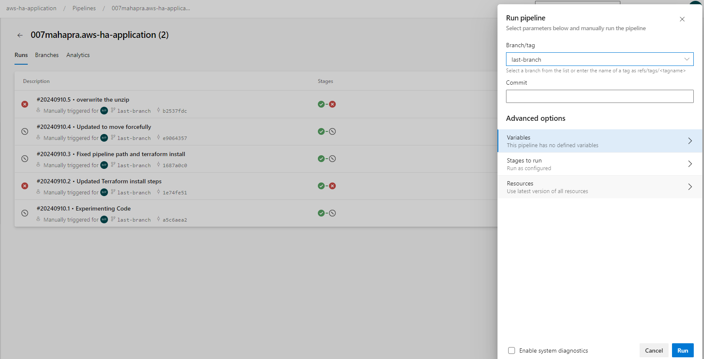
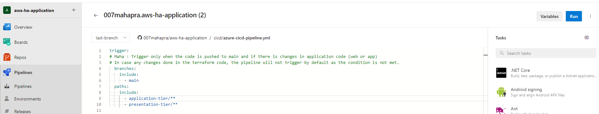

# Three Tier Infra on AWS - with Automated Build of Application and Deployment 
This project demonstrates creation of three tier architecutre on AWS Cloud. It has following architecture 


## High Level Architecture
1. **Application Tier** - This tier consists of the application code. It is built using ExpressJS framework and it serves API endpoints.
2. **Presentation Tier** - This tier consists of the web application code. It is built using ExpressJS framework and it serves the web pages and allows CRUD operations on the data.
3. **Database Tier** - This tier consists of the database. It is built using MySQL database running on RDS. 


## AWS Services Used
Following AWS services are used in this project:
  - 1 VPC
  - 2 Public subnets - For presentation tier
  - 2 Private subnets - For application tier 
  - 2 Autoscaling groups - 1 for application tier, 1 for presentation tier
  - 5 Security Groups 
  - 2 Load Balancers, (one private, one public)
  - 2 Private EC2 instances (representing application tier)
  - 2 Public EC2 instances (representing  presentation tier)
  - 2 Nat Gateways (to allow private instances to connect to the internet)
  - 2 Elastic IP addresses, one for each Nat gateway
  - 1 rds instance - For database tier
  - 1 secret manager to store the database credentials

## Architecture Diagram

Here is the high level architecture diagram of the project:


## Azure DevOps Pipeline
The Azure DevOps pipeline is used to deploy the infrastructure and the application. The pipeline is defined in [cicd](cicd/) folder.
Written in YAML format, it is a declarative pipeline that defines the steps to be executed. [azure-cicd-pipline.yml](cicd/azure-cicd-pipeline.yml)  

**This pipeline has 2 major steps**

Here  are the steps in the pipeline:
 
1. First stage builds the application and creates the docker images in AWS ECR when there is any change in the application code. The trigger for this pipeline is when there is any change in the following folders:
      - application-tier/**
      - presentation-tier/**
   ```yml
   # Smmary of steps in stage 1
   steps:
    - Install AWS CLI & jq
    - Login to AWS ECR
    - Build and push the docker images to ECR
   ```
2. If the build was successful, the pipeline deploys the infrastructure and the application in 2nd stage.
   ```yml
   # Smmary of steps in stage 2
   steps:
    - Install Terraform
    - Terraform init - Fail next steps if init fails
    - Terraform validate - Fail next steps if validation fails
    - Terraform plan - Plan the infrastructure and store plan in a human readable file under artifacts 
    - Terraform apply is commented as the infra gets deployed and charges money , uncomment the line to deploy the infra
    - Terraform destroy in case the terraform apply fails, this is also commented 
   ```
### Setting up the pipeline in Azure DevOps and Testing the CICD pipeline
1. Clone the repository to your local machine.
2. Push the code to any of SCM , I used Github and created a repo in Github.
3. Create a new project in Azure DevOps and authenticate Github and connect it to the repository. Refer to Github connector for authenticating Github [this](https://learn.microsoft.com/en-us/azure/devops/cross-service/github-integration?view=azure-devops) , [Reference](https://dev.to/pwd9000/integrating-azure-devops-with-github-hybrid-model-3pkg)

4. Create a new pipeline in Azure DevOps and select the repository and the branch to be used. Refer screenshot below:

5. Set Variables in Azure DevOps for the following:
    ```bash    
    - AWS_ACCESS_KEY_ID - Secret variable
    - AWS_SECRET_ACCESS_KEY - Secret variable
    - AWS_DEFAULT_REGION - Can be plaintext variable
    ```
    

6. Manually Run the pipeline by choosing the branch, but by default it will run the pipeline on the main branch when there is a push to the main branch.
   

7. Successful run of pipeline will look like this:


## Running manually

### Prerequisites
1. Install the following tools:
  - [Terraform](https://www.terraform.io/downloads.html) (Tested on v1.5.7)
  - [AWS CLI](https://docs.aws.amazon.com/cli/latest/us/cli/latest/userguide/getting-started-install.html)   (Version 2.13.29)
  - [Docker](https://docs.docker.com/get-docker/)
  - [JQ](https://stedolan.github.io/jq/download/)

2. Setup the envirnonment variables (I created a User in AWS and created a access key and secret key for that user and assigned appropriate permissions so it can create the infrastructure.):
**Warning**: Do not commit the access key and secret key to the repository. Do not use the root user's access key and secret key.

 **For Linux/Mac:**
   ```bash
   export AWS_ACCESS_KEY_ID='<YOUR-AWS-ACCESS-KEY-ID>'
   export AWS_SECRET_ACCESS_KEY='<YOUR-AWS-ACCESS-KEY-SECRET>'
   export AWS_DEFAULT_REGION='us-east-1' # Replace with your desired region
   ```

 **For Windows in Powershell:**
   ```powershell
   set AWS_ACCESS_KEY_ID='<YOUR-AWS-ACCESS-KEY-ID>'
   set AWS_SECRET_ACCESS_KEY='<YOUR-AWS-ACCESS-KEY-SECRET>'
   set AWS_DEFAULT_REGION='us-east-1' # Replace with your desired region
   ```

2. Create docker images for both web and app tiers and push them to AWS ECR
```bash
chmod +x ./deploy-ecr-images.sh
./deploy-ecr-images.sh
```

3. Deploy the Terraform infrastructure
```bash
cd terraform/
terraform init # Initialize the Terraform backend
terraform plan # Plan the infrastructure
terraform apply # Apply the infrastructure
```

4. Access the application on web browser using ALB DNS name
```
To view the application, open the following URL in your browser:
   http://<ALB-DNS>/ 

To initialize the database, open the following URL in your browser:
   http://<ALB-DNS>/init

To view the users, open the following URL in your browser:
  http://<ALB-DNS>/users
```

5. Deploy the Terraform infrastructure
```bash
cd terraform/
terraform destroy # Destroy the infrastructure
```

6. Delete the ECR images
```bash
chmod +x ./destroy-ecr-images.sh
./destroy-ecr-images.sh
```

## References
https://ecsworkshop.com/secrets/02-overview/